<div align="center">

# ehr2summary — Grounded Discharge Summaries With Checked Evaluation

**ehr2summary is a generation and evaluation benchmark for hospital discharge summaries. It takes coded MIMIC-III style tables through these steps to a scored, per-system report:**

`load tables` → `build de-identified records` → `generate summaries` → `check faithfulness` → `score with an independent judge` → `aggregate with intervals`.


**[Summary](#1-summary)** ·
**[Workflow](#4-the-end-to-end-workflow)** ·
**[Run it](#10-how-to-run-ehr2summary)** ·
**[Configuration](#104-environment-variables)** ·
**[Known problems](#13-known-problems)** ·
**[Glossary](#15-glossary)**

</div>

> [!NOTE]
> This README uses ASD-STE100 Simplified Technical English. The writing rules and the project
> vocabulary are in [`docs/ste-style-guide.md`](docs/ste-style-guide.md). Each term in the
> [Glossary](#15-glossary) has only one meaning.

> [!WARNING]
> Do not use a generated summary for patient care. ehr2summary is a research benchmark, not a medical decision tool.
> A clinician must review every summary. Keep MIMIC data on machines that your data use agreement permits.

---

ehr2summary makes a discharge summary from the coded data of one admission and then measures how good it is. Each
statement in a summary cites the record items that support it. A rule-based check finds diagnoses, procedures and
medicines that are not in the record. A judge model then scores the summary against the same record, and the report
gives each number with a 95% bootstrap interval.

This README is the **one location that explains all of ehr2summary**. It gives these topics:

- the general design
- each component and its procedure, step by step
- the decision rules
- the data map
- the runbook
- the validation results and the known problems

| If you are… | Read |
|---|---|
| A manager or reviewer | [1](#1-summary), [3](#3-design-rules), [4](#4-the-end-to-end-workflow), [12](#12-validation-results), [14](#14-key-points) |
| A developer who joins the project | All sections, in sequence. Keep [10](#10-how-to-run-ehr2summary) and [13](#13-known-problems) open while you work |
| An operator who runs ehr2summary | [10](#10-how-to-run-ehr2summary), then the section for the component that you use |

---

## Table of contents

1. 🧭 [Summary](#1-summary)
2. 🏗️ [How ehr2summary is built](#2-how-ehr2summary-is-built)
   - 2.1 [Components](#21-components)
   - 2.2 [System context](#22-system-context)
   - 2.3 [Repository layout](#23-repository-layout)
3. 🛡️ [Design rules](#3-design-rules)
4. 🔄 [The end-to-end workflow](#4-the-end-to-end-workflow)
   - 4.1 [Full flow](#41-full-flow)
   - 4.2 [The life cycle of one admission](#42-the-life-cycle-of-one-admission)
   - 4.3 [Who does which step](#43-who-does-which-step)
5. 🔵 [The record builder](#5-the-record-builder)
6. 🟢 [The generators](#6-the-generators)
7. 🟣 [The faithfulness check and the judges](#7-the-faithfulness-check-and-the-judges)
8. ⚖️ [The scores and the decision rules](#8-the-scores-and-the-decision-rules)
9. 🗂️ [Data and file map](#9-data-and-file-map)
10. ▶️ [How to run ehr2summary](#10-how-to-run-ehr2summary)
    - 10.1 [Prerequisites](#101-prerequisites) · 10.2 [Installation](#102-installation) · 10.3 [Run ehr2summary](#103-run-ehr2summary) · 10.4 [Environment variables](#104-environment-variables)
11. 🧩 [How to extend ehr2summary](#11-how-to-extend-ehr2summary)
12. ✅ [Validation results](#12-validation-results)
13. ⚠️ [Known problems](#13-known-problems)
14. 📌 [Key points](#14-key-points)
15. 📖 [Glossary](#15-glossary)
16. 📄 [License](#16-license)

---

## 1. Summary

**The problem.** A language model can write a fluent discharge summary that contains facts that are not in the chart. These are the difficult questions:

- Which facts can the generator use, and how does it show where each fact comes from?
- How do you find diagnoses and medicines that the generator invented?
- How do you make a judge score correctness and not only fluency?
- How do you know that the judge agrees with clinicians?

ehr2summary gives each of these questions its own component. All components run offline on synthetic tables, and the chat models are optional.

| Item | Value |
|---|---|
| Input | MIMIC-III style CSV tables (the demo release, the full release or synthetic tables) |
| Output | `rows.jsonl` (one row for each summary) and `report.json` (one entry for each system) |
| Components | **6**: table loader, record builder, generators, faithfulness check, judges, benchmark runner |
| Providers | Any OpenAI-compatible endpoint (Ollama, vLLM, OpenAI) or a local Hugging Face model. All optional |
| Offline mode | Template generator, two error injectors, rule judge, ROUGE, agreement statistics |
| Safety | No identifiers or dates in prompts. Real records stay on local endpoints. The judge must differ from the generator |
| Tests | **45** unit tests (`pytest`), 0 skipped |


---

## 2. How ehr2summary is built

### 2.1 Components

| Component | Module | Purpose |
|---|---|---|
| Configuration | `src/ehr2summary/config.py` | Read and check all `EHR2SUMMARY_*` environment variables |
| Table loader | `src/ehr2summary/tables.py` | Read the CSV tables, check the columns, keep ICD-9 codes as text |
| Record builder | `src/ehr2summary/records.py` | Make one de-identified record for each admission, select a seeded sample |
| Chat models | `src/ehr2summary/llm.py` | OpenAI-compatible adapter with logprobs, Hugging Face adapter, privacy guard |
| Summary schema | `src/ehr2summary/summary.py` | Five sections of statements with reference ids, JSON parser |
| Prompts | `src/ehr2summary/prompts.py` | Generator prompt, judge prompt with the record, the rubric |
| Generators | `src/ehr2summary/generators.py` | Template generator, chat model generator, error injectors |
| Faithfulness check | `src/ehr2summary/faithfulness.py` | Unsupported terms, invalid reference ids, unknown codes, entity precision and recall |
| Judges | `src/ehr2summary/judge.py` | Chat model judge (JSON or logprob mode) and rule judge |
| Metrics | `src/ehr2summary/metrics.py` | ROUGE-1, ROUGE-2, ROUGE-L, Spearman, Kendall tau-b, bootstrap intervals |
| Benchmark runner | `src/ehr2summary/pipeline.py` | Run all systems, aggregate, write outputs, judge-human agreement |
| Synthetic data | `src/ehr2summary/synthetic.py` | Invented admissions in the MIMIC-III table layout |
| CLI | `src/ehr2summary/cli.py` | The `ehr2summary` command |

The component map shows which module calls which module. An arrow points from the caller to the module that it uses.

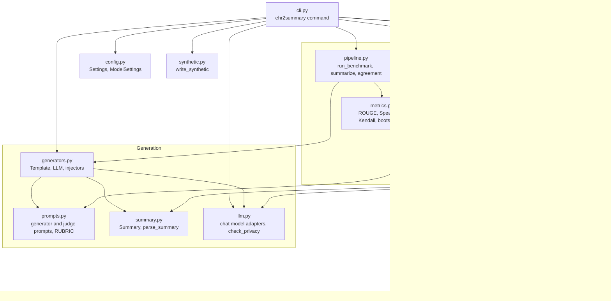

### 2.2 System context

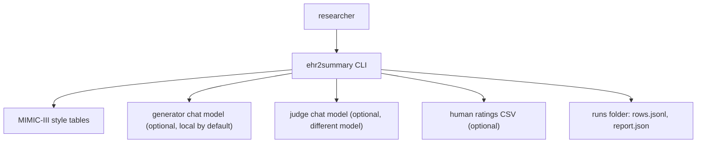

### 2.3 Repository layout

```
ehr2summary/
├── .github/workflows/ci.yml   # CI: install ".[dev]" and run pytest on Python 3.11
├── data/README.md             # data sources, licences, table columns, ratings format
├── docs/ste-style-guide.md    # writing rules and project vocabulary
├── src/ehr2summary/           # the package (one module for each component, see 2.1)
├── tests/                     # pytest suite: 45 tests, synthetic tables only
├── .env.example               # variable names only
├── pyproject.toml             # core dependencies, extras and the console script
└── LICENSE                    # MIT
```

---

## 3. Design rules

### 3.1 The judge sees the source record
`prompts.judge_messages` puts the record and the summary in the same prompt. The judge can compare each fact with the record. A judge without the record can score only fluency.

### 3.2 The judge is a different model
`judge.ensure_independent` stops a run if the judge model is also the generator model. You can override this with `EHR2SUMMARY_ALLOW_SELF_JUDGE=true`, but self-scores are biased.

### 3.3 The generator gets descriptions, not bare codes
The record builder maps each ICD-9 code to its title from the dictionary. It uses `PROCEDURES_ICD` for procedures, and it adds medications and abnormal lab results. The generator prompt tells the model to write "Not documented in the record." when a section has no data.

### 3.4 Each statement cites its items
A statement lists the reference ids of the items that support it. The faithfulness check reports reference ids that do not exist.

### 3.5 Generation and scoring are separate calls
The generator prompt has no rubric. The judge prompt has no generation task. A summary cannot contain self-scores.

### 3.6 Reproducible runs
The admission sample uses a seed. Generation uses temperature 0 and a fixed seed. Judge scores are parsed into numbers. The report gives the mean and a 95% bootstrap interval for each number.

### 3.7 De-identified prompts and local endpoints
A record has a salted pseudonymous id, an age group and a length of stay. It has no subject id, no admission id and no dates. `llm.check_privacy` refuses to send a record that is not synthetic to a remote endpoint unless `EHR2SUMMARY_ALLOW_REMOTE_RECORDS=true`.

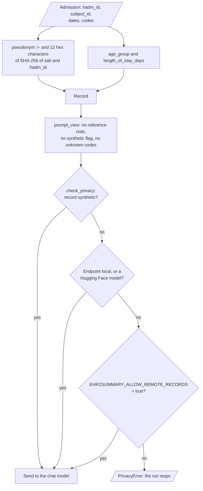

---

## 4. The end-to-end workflow

### 4.1 Full flow

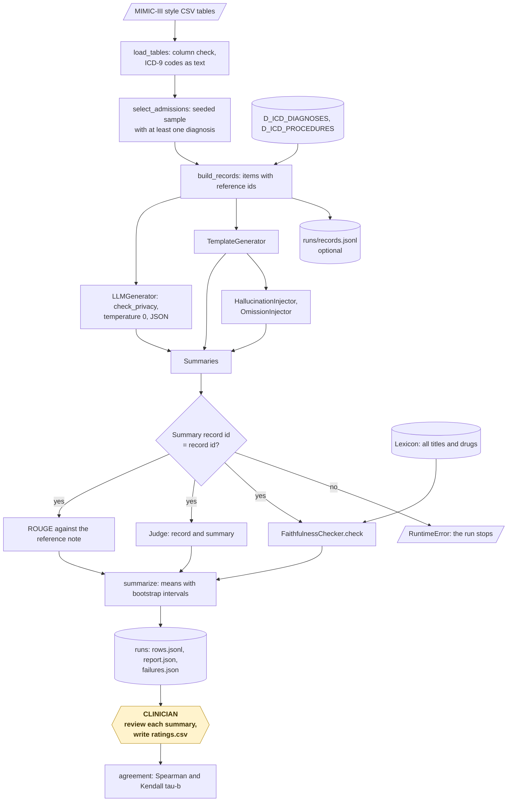

### 4.2 The life cycle of one admission

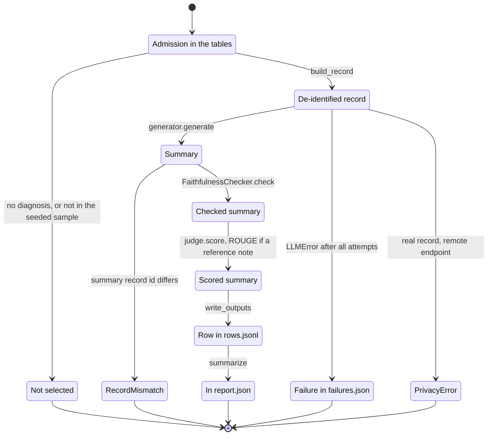

1. The selector picks the admission with the seed `EHR2SUMMARY_SEED`.
2. The record builder writes the record with the id `r-…`, the items and the reference note, if there is one.
3. A generator writes the summary. The summary gets the record id from the record, not from the model reply.
4. The runner stops if the summary record id is not the record id.
5. The faithfulness check finds the mentions in each statement and compares them with the record items.
6. The judge scores the summary on the four criteria. It gets the record and the summary.
7. If the record has a reference note, the runner calculates ROUGE.
8. The runner writes one row to `rows.jsonl`. After all rows, it writes `report.json`.

### 4.3 Who does which step

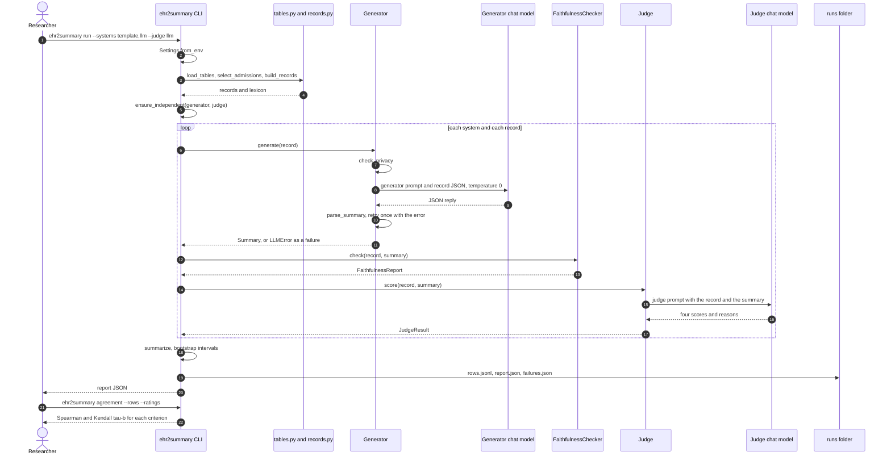

---

## 5. The record builder

**Purpose.** Make one structured, de-identified record for each admission. The record is the only input of the generator and of the judge.

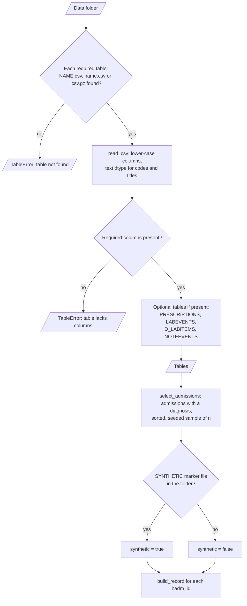

`build_record` makes one record:

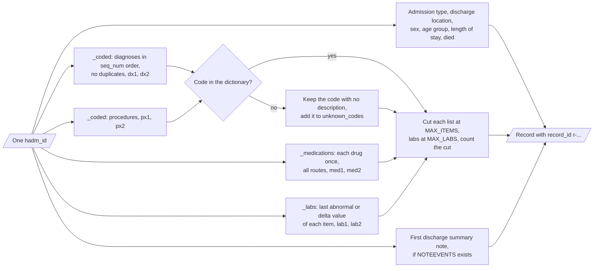

| Input | Output |
|---|---|
| `ADMISSIONS`, `PATIENTS`, `DIAGNOSES_ICD`, `PROCEDURES_ICD`, the two dictionaries, and optional `PRESCRIPTIONS`, `LABEVENTS`, `D_LABITEMS`, `NOTEEVENTS` | `Record` (pydantic): items with reference ids, context fields, truncation counts, unknown codes, reference note |

**Procedure**

1. Load each table. Make the column names lower case. Read ICD-9 codes as text.
2. Select the admissions that have at least one diagnosis. Sort them and draw a seeded sample.
3. Map each diagnosis and procedure code to its long title, in `seq_num` order. Remove duplicate codes.
4. If a code has no title, keep the code with the text "no description in the dictionary" and add it to `unknown_codes`.
5. Add each drug one time, with all of its routes.
6. Add the last abnormal value of each lab item. Abnormal means the flag `abnormal` or `delta`.
7. Keep at most `EHR2SUMMARY_MAX_ITEMS` items in each list and `EHR2SUMMARY_MAX_LABS` labs. Record the number that was cut.
8. Calculate the age group and the length of stay. Make the record id from a salted SHA-256 value of the admission id.

**Rules**

- MIMIC shifts the birth date of patients older than 89. The builder puts these patients in the age group `80+`.
- The prompt view of a record has no reference note, no `synthetic` flag and no unknown-code list.

| Age group | Age at admission |
|---|---|
| `<18` | under 18 |
| `18-39` | 18 to 39 |
| `40-64` | 40 to 64 |
| `65-79` | 65 to 79 |
| `80+` | 80 or more, or a shifted birth date |

---

## 6. The generators

**Purpose.** Write one summary for each record. Each system is one generator.

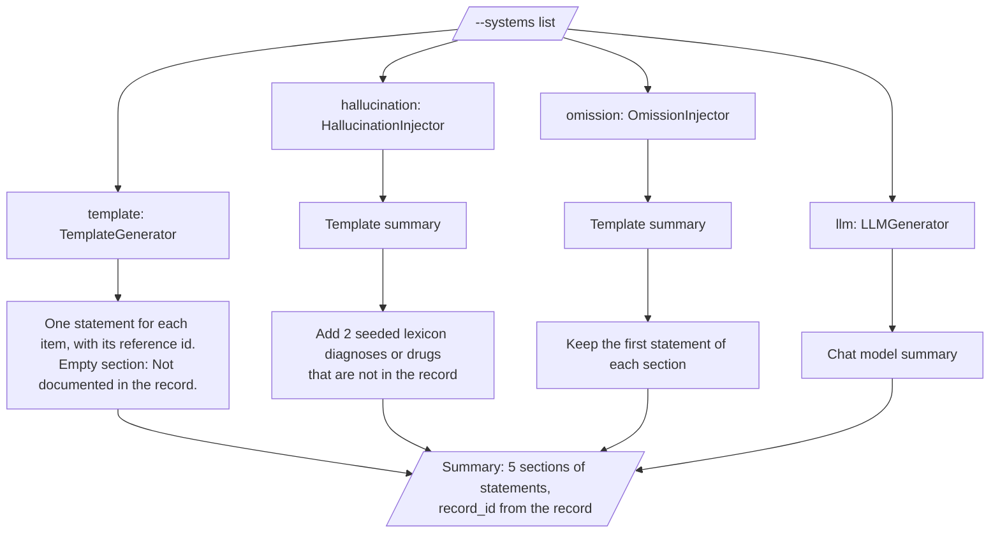

| System | What it does |
|---|---|
| `template` | Offline baseline. One statement for each item, with its reference id |
| `template+hallucination` | The template summary plus 2 statements with diagnoses or drugs from the lexicon that are not in the record |
| `template+omission` | The template summary with only the first statement of each section |
| `llm:<provider>:<model>` | A chat model at temperature 0 with a fixed seed. The reply must be JSON |

**Procedure (chat model generator)**

1. Check the privacy rule for the record and the endpoint.
2. Send the generator prompt and the record JSON.
3. Parse the JSON reply. Unknown section names are an error. A section that is a string becomes one statement.
4. If the reply is not valid, send the error and try again. The default is 2 attempts.
5. If all attempts fail, the runner records a failure for this record and continues.

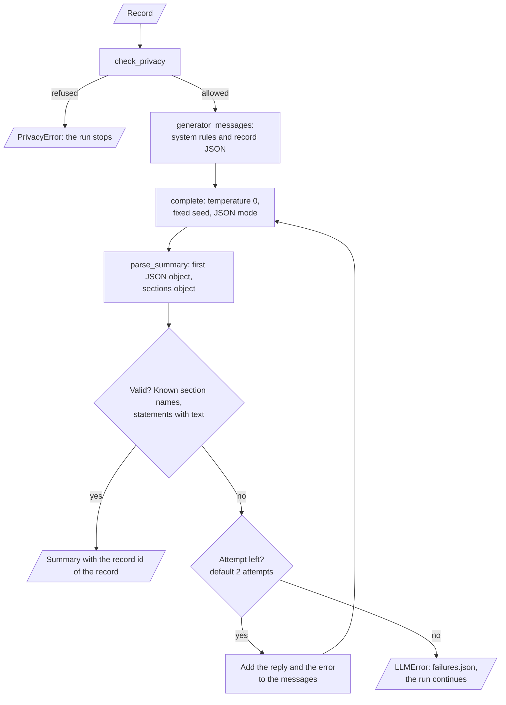

**Rules**

- The Hugging Face adapter uses the chat template of the model and returns only the new text (`return_full_text=False`).
- The injectors give summaries with known errors. A good evaluation must give them lower scores than `template`.

---

## 7. The faithfulness check and the judges

**Purpose.** Find unsupported facts with rules, then score each summary with a judge that sees the record.

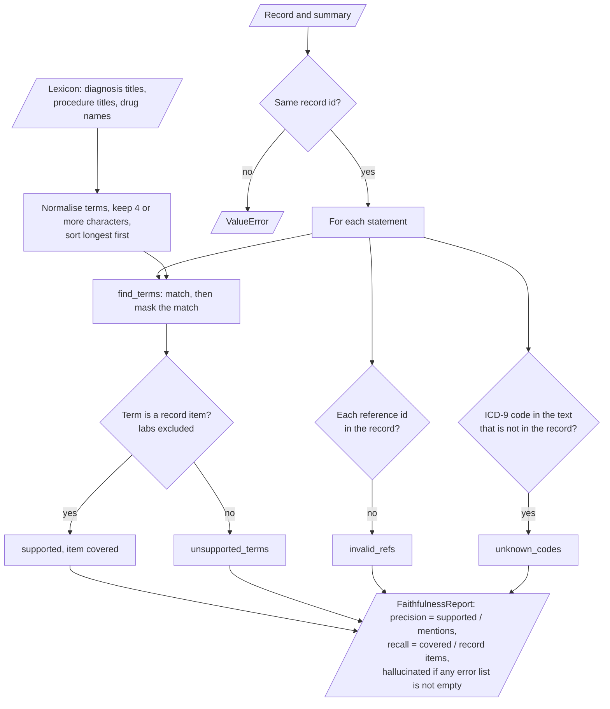

| Input | Output |
|---|---|
| A record, a summary and the lexicon | `FaithfulnessReport`: mentions, supported mentions, unsupported terms, invalid reference ids, unknown codes, entity precision, entity recall |
| A record and a summary | `JudgeResult`: a score from 0 to 10 for each criterion, the spread over samples, the reasons |

**Procedure (faithfulness check)**

1. Make the lexicon from all diagnosis titles, procedure titles and drug names in the tables.
2. Search each statement for lexicon terms, longest term first. Mask each match, so a shorter term does not match again.
3. A mention that is a record item is supported. Other mentions are unsupported terms.
4. A reference id that is not in the record is an invalid reference id.
5. A text like "ICD-9 code 999.9" with a code that is not in the record is an unknown code.
6. Entity recall is the share of record diagnoses, procedures and medications that a supported mention covers.

**Procedure (chat model judge)**

1. Check the privacy rule. Check that the judge differs from the generator.
2. In `json` mode, ask for all four scores and reasons. Parse the scores. Accept keys such as "Clinical Accuracy" and values such as "7/10".
3. Repeat for `EHR2SUMMARY_JUDGE_SAMPLES` samples with the seeds `seed`, `seed+1`, and so on. Return the mean and the spread.
4. In `logprob` mode, ask for one criterion at a time and one integer. Weight each score token 0 to 10 by its probability (G-Eval).

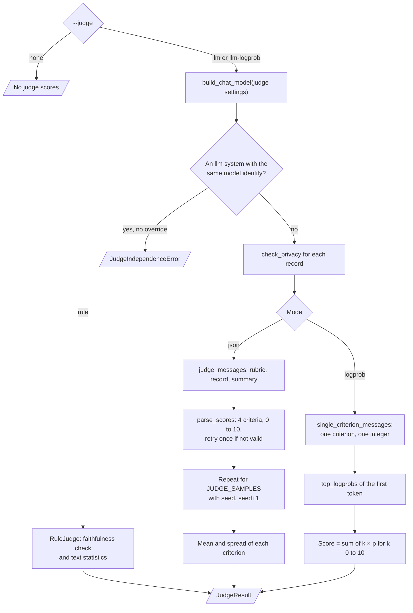

**Rules**

- The rule judge is an offline baseline. It is not a validated clinical judge.
- A score outside 0 to 10 or a missing criterion makes the reply not valid.

---

## 8. The scores and the decision rules

| Criterion | What the rubric asks |
|---|---|
| `clinical_accuracy` | Are all diagnoses, procedures, medicines and results supported by the record? |
| `completeness` | Does the summary cover the main diagnoses, procedures, medicines and abnormal results? |
| `readability` | Is the summary clear, well organized and in correct clinical English? |
| `actionability` | Does the summary give the discharge location, the medicines and the results that need follow-up? |

| Rule judge criterion | Formula |
|---|---|
| `clinical_accuracy` | 10 × entity precision − 2 × invalid reference ids − 2 × unknown codes |
| `completeness` | 10 × entity recall |
| `readability` | 10 − 0.4 × (mean statement words − 25 if above 25) − 1.0 × (5 − mean words if below 5) |
| `actionability` | 4 for a discharge location (or death) + 3 for cited medications (or no medications in the record) + 3 for cited labs in the follow-up section (or no labs in the record) |

All rule judge scores are clipped to 0 to 10.

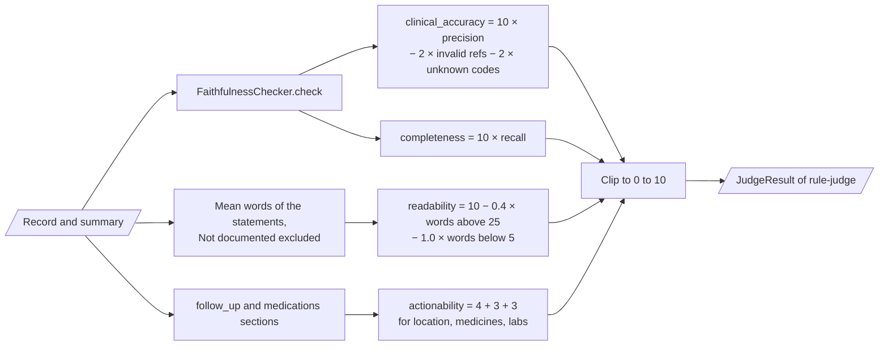

The runner aggregates the rows of each system:

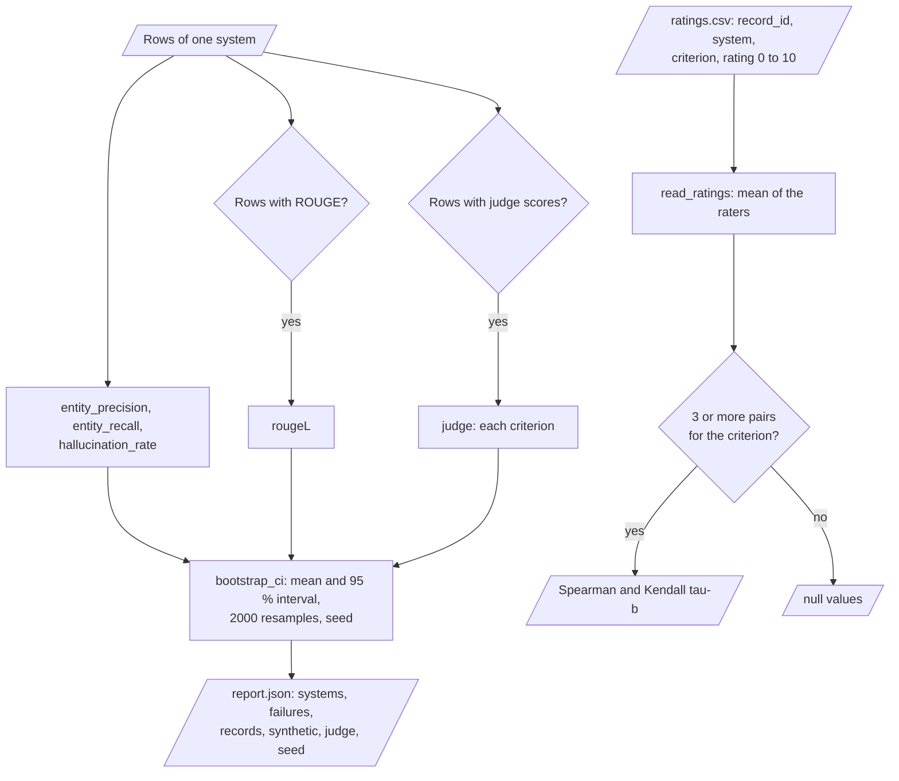

| Report value | Meaning |
|---|---|
| `entity_precision` | Mean entity precision over the summaries of a system |
| `entity_recall` | Mean entity recall |
| `hallucination_rate` | Share of summaries with an unsupported term, an invalid reference id or an unknown code |
| `rougeL` | Mean ROUGE-L F1 against the reference notes (only records with a note) |
| `judge` | Mean judge score for each criterion |
| `ci95` | 95% percentile bootstrap interval of the mean (2,000 resamples, seeded) |

| Guard | Rule | Override |
|---|---|---|
| Judge independence | The judge model must differ from the generator model | `EHR2SUMMARY_ALLOW_SELF_JUDGE=true` |
| Privacy | A record that is not synthetic goes only to `localhost`, `127.0.0.1`, `::1` or `0.0.0.0`, or to a local Hugging Face model | `EHR2SUMMARY_ALLOW_REMOTE_RECORDS=true` |
| Record match | A summary with another record id stops the run | None |

---

## 9. Data and file map

| Path | Committed? | Contents |
|---|---|---|
| `data/README.md` | Yes | Sources, licences, table columns, ratings format |
| `data/mimic-iii-demo/` | No (git ignores it) | MIMIC-III demo CSV files |
| `data/synthetic/` | No (git ignores it) | Output of `ehr2summary synth` |
| `runs/records.jsonl` | No (git ignores it) | Output of `ehr2summary records` |
| `runs/rows.jsonl` | No (git ignores it) | One row for each summary: summary, faithfulness, judge scores, ROUGE |
| `runs/report.json` | No (git ignores it) | Aggregated values for each system |
| `runs/failures.json` | No (git ignores it) | Records that a generator could not summarize |
| `runs/demo/` | No (git ignores it) | Output of `ehr2summary demo` |
| `.env` | No (git ignores it) | Local credentials |

---

## 10. How to run ehr2summary

### 10.1 Prerequisites

| Need | For |
|---|---|
| Python 3.11+ | All components |
| MIMIC-III demo CSV files | Real records (see `data/README.md`) |
| Ollama or another OpenAI-compatible endpoint | Optional: chat model generator or judge |
| A GPU with about 16 GB | Optional: 7B models through the `hf` extra |

### 10.2 Installation

```bash
git clone https://github.com/KrishnaAnnavaram/ehr2summary.git
cd ehr2summary
python -m venv .venv
. .venv/bin/activate            # Windows: .venv\Scripts\activate
pip install -e ".[dev]"         # extras: hf, bertscore, all
```

### 10.3 Run ehr2summary

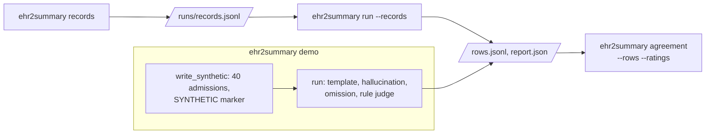

```bash
# 1. Offline demo: synthetic tables, three systems, rule judge
ehr2summary demo --out runs/demo

# 2. The MIMIC-III demo release, offline systems
ehr2summary records --data-dir data/mimic-iii-demo --n 50 --out runs/records.jsonl
ehr2summary run --data-dir data/mimic-iii-demo --records runs/records.jsonl \
    --systems template,hallucination,omission --judge rule --out runs/offline

# 3. A local generator and a different local judge through Ollama
ollama pull mistral:7b-instruct && ollama pull llama3.1:8b
export EHR2SUMMARY_GENERATOR_PROVIDER=openai EHR2SUMMARY_GENERATOR_MODEL=mistral:7b-instruct
export EHR2SUMMARY_JUDGE_PROVIDER=openai EHR2SUMMARY_JUDGE_MODEL=llama3.1:8b
ehr2summary run --data-dir data/mimic-iii-demo --records runs/records.jsonl --systems template,llm --judge llm --out runs/llm

# 4. Judge-human agreement
ehr2summary agreement --rows runs/llm/rows.jsonl --ratings ratings.csv
```

`ehr2summary synth --out data/synthetic` writes the synthetic tables only. `--judge llm-logprob` uses the G-Eval probability weighting. It needs an endpoint that returns `top_logprobs`.

### 10.4 Environment variables

| Variable | Used by | Meaning |
|---|---|---|
| `EHR2SUMMARY_DATA_DIR` | Table loader | Folder with the CSV tables. Default `data/mimic-iii-demo` |
| `EHR2SUMMARY_WORK_DIR` | Runner | Output folder. Default `runs` |
| `EHR2SUMMARY_SEED` | Selector, generator, judge, bootstrap | Default 0 |
| `EHR2SUMMARY_N_RECORDS` | Selector | Admissions in the sample. Default 50 |
| `EHR2SUMMARY_MAX_ITEMS` | Record builder | Items in each list. Default 25 |
| `EHR2SUMMARY_MAX_LABS` | Record builder | Abnormal labs in a record. Default 12 |
| `EHR2SUMMARY_ID_SALT` | Record builder | Salt of the record id. Set a secret value for real data |
| `EHR2SUMMARY_GENERATOR_PROVIDER` | Generator | `offline` (default), `openai` or `hf` |
| `EHR2SUMMARY_GENERATOR_MODEL` | Generator | Model name, for example `mistral:7b-instruct` |
| `EHR2SUMMARY_GENERATOR_BASE_URL` | Generator | Default `http://localhost:11434/v1` |
| `EHR2SUMMARY_GENERATOR_API_KEY` | Generator | Bearer token. Empty for Ollama |
| `EHR2SUMMARY_GENERATOR_TIMEOUT_S` | Generator | HTTP timeout. Default 120 |
| `EHR2SUMMARY_JUDGE_PROVIDER` | Judge | `offline` (default), `openai` or `hf` |
| `EHR2SUMMARY_JUDGE_MODEL` | Judge | Model name. Must differ from the generator model |
| `EHR2SUMMARY_JUDGE_BASE_URL` | Judge | Default `http://localhost:11434/v1` |
| `EHR2SUMMARY_JUDGE_API_KEY` | Judge | Bearer token |
| `EHR2SUMMARY_JUDGE_TIMEOUT_S` | Judge | HTTP timeout. Default 120 |
| `EHR2SUMMARY_JUDGE_SAMPLES` | Judge | Samples for each summary, 1 to 20. Default 1 |
| `EHR2SUMMARY_JUDGE_TEMPERATURE` | Judge | Default 0. Use more than 0 with more than one sample |
| `EHR2SUMMARY_ALLOW_SELF_JUDGE` | Judge | `false` (default) or `true` |
| `EHR2SUMMARY_ALLOW_REMOTE_RECORDS` | Privacy guard | `false` (default) or `true` |

Credentials are only in a local `.env` file. Git ignores this file. Do not print or commit credentials.

---

## 11. How to extend ehr2summary

| You want to… | Do this | Code change? |
|---|---|---|
| Use another local or hosted model | Set the `EHR2SUMMARY_GENERATOR_*` or `EHR2SUMMARY_JUDGE_*` variables | No |
| Use a Hugging Face model | `pip install -e ".[hf]"` and set the provider to `hf` | No |
| Add human ratings | Write the ratings CSV and run `ehr2summary agreement` | No |
| Add a new error type | Write an injector class with `name` and `generate(record)` | Small |
| Add BERTScore | Install the `bertscore` extra and add the call in `pipeline.run_benchmark` | Small |
| Use MIMIC-IV | Write a loader that gives the same `Tables` object (ICD-10 codes and new table names) | Yes |

---

## 12. Validation results

| Validation | Result | Command |
|---|---|---|
| Unit tests | **45 passed**, 0 skipped | `pytest -q` |
| Offline demo | 40 synthetic records, 3 systems, 0 failures | `ehr2summary demo` |

Offline demo results (synthetic tables, rule judge, mean and 95% bootstrap interval):

| System | Entity precision | Entity recall | Hallucination rate | ROUGE-L (30 notes) | Rule judge accuracy | Rule judge completeness |
|---|---|---|---|---|---|---|
| `template` | 1.000 [1.000, 1.000] | 0.998 [0.993, 1.000] | 0.000 | 0.337 [0.314, 0.360] | 10.00 | 9.98 |
| `template+hallucination` | 0.823 [0.812, 0.833] | 0.998 [0.993, 1.000] | 1.000 | 0.316 [0.293, 0.337] | 8.23 | 9.98 |
| `template+omission` | 1.000 [1.000, 1.000] | 0.281 [0.265, 0.297] | 0.000 | 0.271 [0.255, 0.287] | 10.00 | 2.81 |

The faithfulness check finds the injected errors in all 40 summaries. The ROUGE-L intervals of `template` and
`template+hallucination` overlap, so ROUGE does not separate a faithful summary from a summary with two invented
diagnoses or drugs. The numbers come from synthetic data with known errors. They show that the evaluation code finds
these errors. They do not show the quality of any chat model, and the rule judge is not a clinical judge. The
prototype reported only single, unseeded examples, so there is no prototype result to compare.

---

## 13. Known problems

Read these problems before you use ehr2summary for research results.

| # | Area | Problem | Impact and action |
|---|---|---|---|
| 1 | Data | CI uses synthetic tables. No result on the MIMIC-III demo or on MIMIC-IV is in this repository | Run the benchmark on the real data and report the numbers with the seed |
| 2 | Faithfulness check | The check matches exact titles and drug names. A paraphrase ("heart failure" for "Congestive heart failure, unspecified") is not found | Entity precision can be too high for chat model summaries. Add synonyms or a clinical concept extractor |
| 3 | Judge | No judge-human agreement is measured yet. The agreement code is tested only on small fixed data | Collect ratings from clinicians and run `ehr2summary agreement` |
| 4 | Reference notes | The MIMIC-III demo has no discharge notes | ROUGE needs MIMIC-IV-Note under a data use agreement |
| 5 | Records | Lab items are the last abnormal values only. Notes, vital signs and the hospital course are not in the record | Summaries cannot describe events that the record does not have |
| 6 | Codes | Only ICD-9 is supported | MIMIC-IV with ICD-10 needs a new loader |
| 7 | Bias | MIMIC comes from one hospital system in one country | Results do not transfer to other populations without a new evaluation |
| 8 | Hugging Face adapter | The `hf` adapter has no unit test in CI (it needs a model download) | Test it on a GPU machine before a run |

---

## 14. Key points

1. **The judge sees the record.** Clinical accuracy is scored against the facts, not only the fluency.
2. **The judge is not the generator.** The run stops if they are the same model.
3. **Invented facts are found by rules.** The faithfulness check counts unsupported terms, invalid reference ids and unknown codes.
4. **ROUGE is not enough.** On the synthetic demo, ROUGE-L does not separate faithful summaries from summaries with invented facts.
5. **Records stay de-identified and local.** No identifiers or dates go to a model, and real records go only to local endpoints by default.

---

## 15. Glossary

| Term | Meaning |
|---|---|
| **Admission** | One hospital stay with one `hadm_id` |
| **Dictionary** | A table that gives each ICD-9 code its title |
| **Record** | The de-identified JSON of one admission |
| **Item** | One diagnosis, procedure, medication or lab result in a record |
| **Reference id** | The id of an item, for example `dx1` |
| **Record id** | The pseudonymous id of a record, for example `r-1a2b3c4d5e6f` |
| **System** | A generator under evaluation |
| **Summary** | The generated discharge summary with five sections |
| **Statement** | One sentence of a summary with its reference ids |
| **Reference note** | A discharge note that ROUGE uses |
| **Lexicon** | All titles and drug names of the tables |
| **Mention** | A lexicon term in a statement |
| **Unsupported term** | A mention that is not an item of the record |
| **Hallucination rate** | The share of summaries with at least one unsupported term, invalid reference id or unknown code |
| **Entity precision** | Supported mentions divided by all mentions |
| **Entity recall** | Covered record items divided by all diagnoses, procedures and medications of the record |
| **Judge** | The component that scores a summary against its record |
| **Rule judge** | The offline judge from the faithfulness check and text statistics |
| **Criterion** | One of the four judge dimensions |
| **Sample** | One judge call |
| **Injector** | A generator that adds known errors |
| **Rating** | One human score for one summary and one criterion |

---

## 16. License

[MIT](LICENSE) © 2026 Krishna Annavaram
